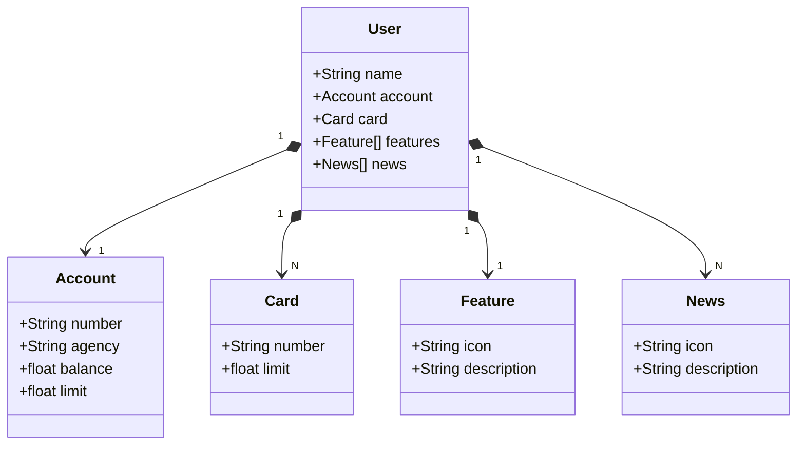

<h1 align="center">Santander Dev Week 2024</h1>
<h4 align="center">Sistema de banco</h4>

  Projeto desafio: 

  

## 📎 Sumário

- [✨ Features](#features)
- [📦 Temas abordados](#topics)
- [💻 Autor](#author)

<h2 id="features">✨ Features</h2>

- Processamento de Pedidos: O projeto parece lidar com pedidos (Order). Cada pedido tem um ID e um valor (amount).
- Pagamentos: O projeto processa pagamentos usando diferentes métodos de pagamento (como cartão de crédito e PayPal).
- Armazenamento Temporário de Dados: O uso do banco de dados H2 em memória sugere que os dados são armazenados temporariamente enquanto a aplicação está em execução.

*As features são temporais, nenhum dado inserido permanece.*

<h2 id="topics">📦 Temas abordados</h2>

Recursos Java presentes no projeto:

- Spring Framework
- Banco de Dados H2
- Hibernate
- Java 17
- Maven

<h2 id="author">💻 Autor</h2>

    
    
&nbsp&nbsp&nbspRobson 
    &nbsp&nbsp&nbsp<a href="http://instagram.com/programi_">Instagram</a>&nbsp;|&nbsp;<a href="https://github.com/Cyber-L4b">GitHub</a>&nbsp;|&nbsp;<a href="https://www.linkedin.com/in/robson-gabriel-b8a200226/">LinkedIn</a>&nbsp;|&nbsp;

  

